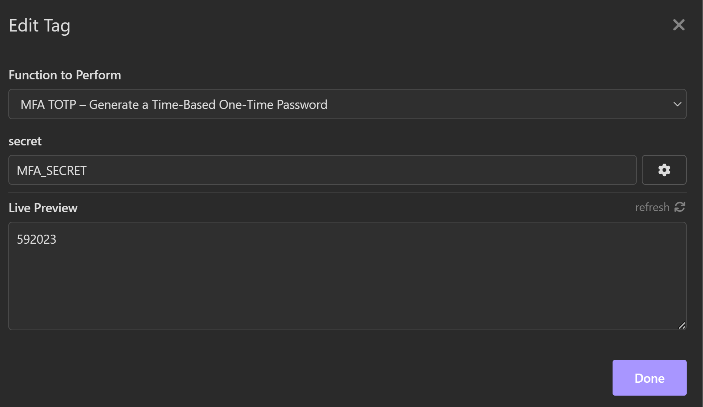

# Insomnia MFA TOTP Generator  

&nbsp;&nbsp;<b>Title</b> MFA TOTP Token Generator &nbsp;&nbsp;<b>Description:</b> Insomnia plugin that will generate a Time-Based One-Time Password based of the secret  &nbsp;&nbsp;<b>Author:</b> Sven Thirion &nbsp &nbsp  

# Prerequisites
The MFA TOTP Generator uses the MFA secret to generate the time-based one time token. This secret will need to be provided  in the Insomnia Environment json file. The default key is `MFA_SECRET`, but can be changed by selecting the `MFA Secret` variable name in the  MFA TOTP configuration (see below).

## Installation  
1. In Insomnia, click "Insomnia' and go to 'Settings'
2. In the Setting window, go to the "Plugin' tab
3. Click "Browse Plugin Hub"
4. Search for "totp"

## Using the plugin  
### Template tags
In order to generate and use the 6 digit MFA TOTP in your request, cllck Control + Space and type 'MFA TOTP'  The default environment MFA Secret variable used is `MFA_SECRET`, but can be changed by selecting the `MFA Secret` gear icon and select the environment variable name in the drop down.

  
